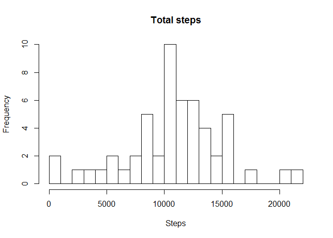
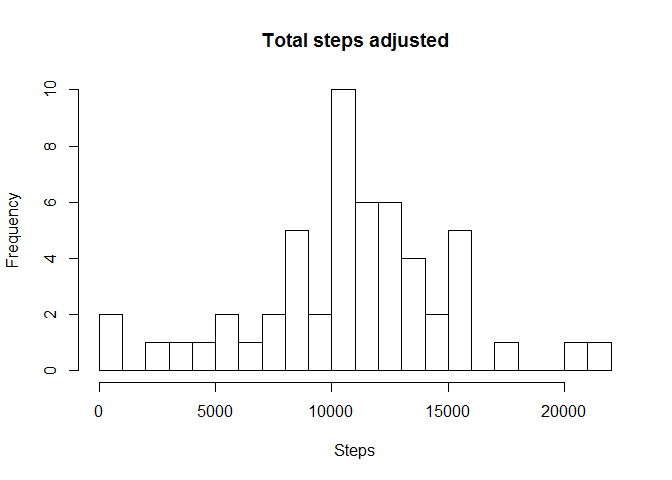
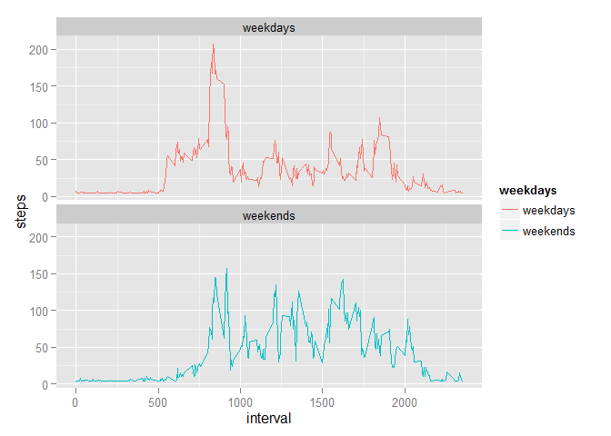

# reproducible research course project 1

Author: Deyu Li

Load and processing the data


```r
library(ggplot2)
library(lubridate)
activity <- read.csv('activity.csv',header = TRUE)
activity$date <- ymd(activity$date)
```

Histogram of the total number of steps taken each day


```r
steps_day <- aggregate(steps~date, data = activity, sum, na.rm = TRUE)
hist(steps_day$steps,breaks = 20, main = "Total steps", xlab = "Steps")
```



Mean number of steps taken each day


```r
mean(steps_day$steps, na.rm = TRUE)
```

```
## [1] 10766.19
```

Median number of steps taken each day


```r
median(steps_day$steps, na.rm = TRUE)
```

```
## [1] 10765
```

Time series plot of the average number of steps taken


```r
mean_steps_interval <- aggregate(steps~interval, data = activity, mean, na.rm= TRUE)
ggplot(mean_steps_interval, aes(x = interval, y = steps))+geom_line()
```


max number of average


```r
mean_steps_interval[which.max(mean_steps_interval$steps),]
```

```
##     interval    steps
## 104      835 206.1698
```

imputing missing values using the mean value of the steps


```r
data_corrected <- activity
data_corrected$steps[is.na(data_corrected$steps)] <- mean(data_corrected$steps, na.rm = TRUE)
steps_day1 <- aggregate(steps~date, data = activity, sum, na.rm = TRUE)
hist(steps_day1$steps,breaks = 20, main = "Total steps adjusted", xlab = "Steps")
```



compare weekdays and weekends


```r
data_corrected$weekdays <- weekdays(data_corrected$date)
data_corrected$weekdays[data_corrected$weekdays == "Saturday" |data_corrected$weekdays == "Sunday"] <- "weekends"
data_corrected$weekdays[data_corrected$weekdays != "weekends"] <- "weekdays"
data_corrected$weekdays <- as.factor(data_corrected$weekdays)
data_compare <- aggregate(steps~interval+weekdays,data = data_corrected, mean)
ggplot(data_compare,aes(x = interval, y = steps, color = weekdays))+geom_line()+
  facet_wrap(~weekdays,ncol = 1, nrow = 2)
```


